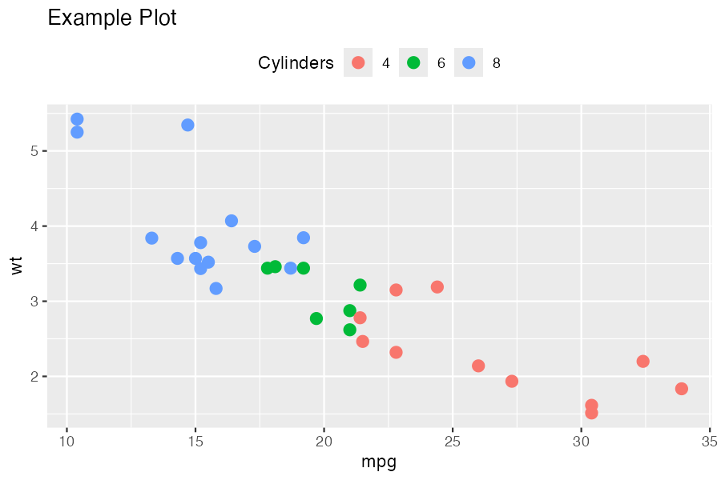
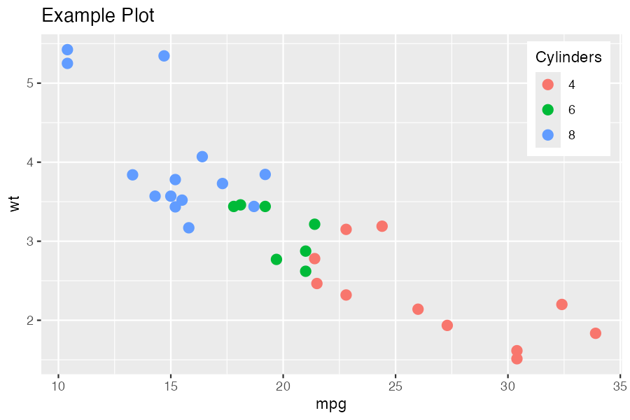
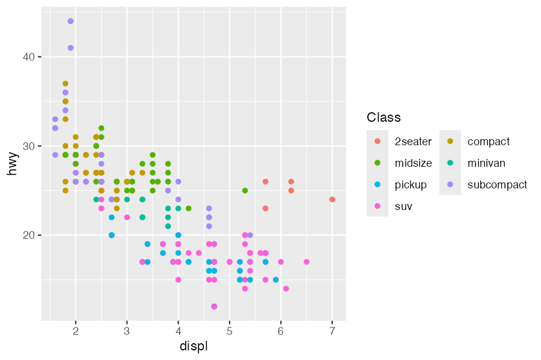
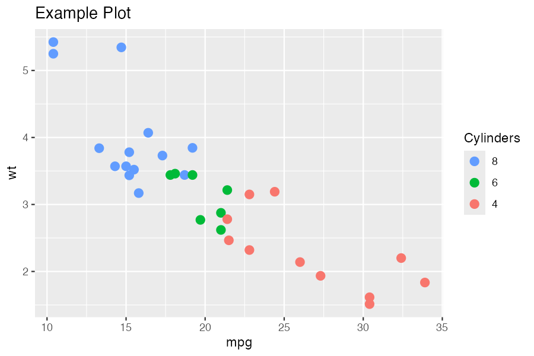
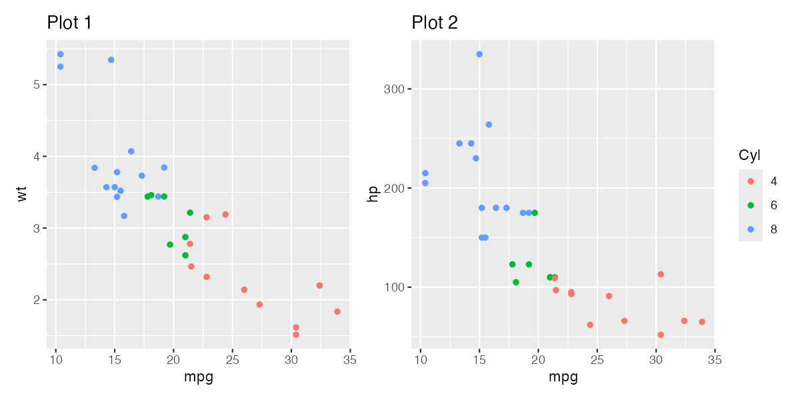
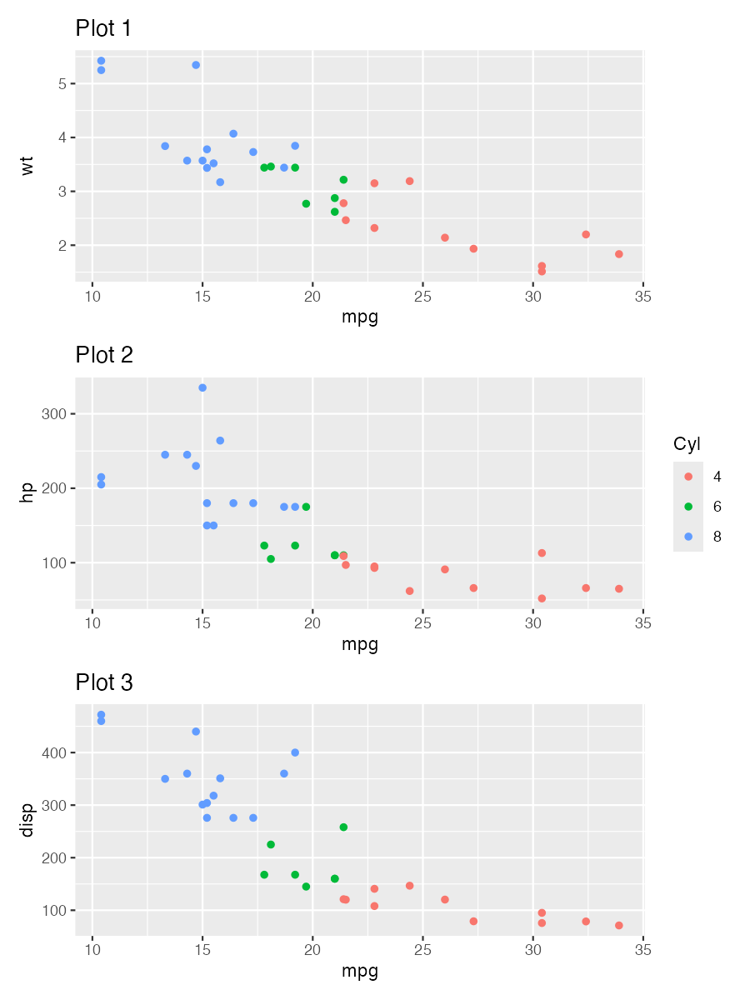
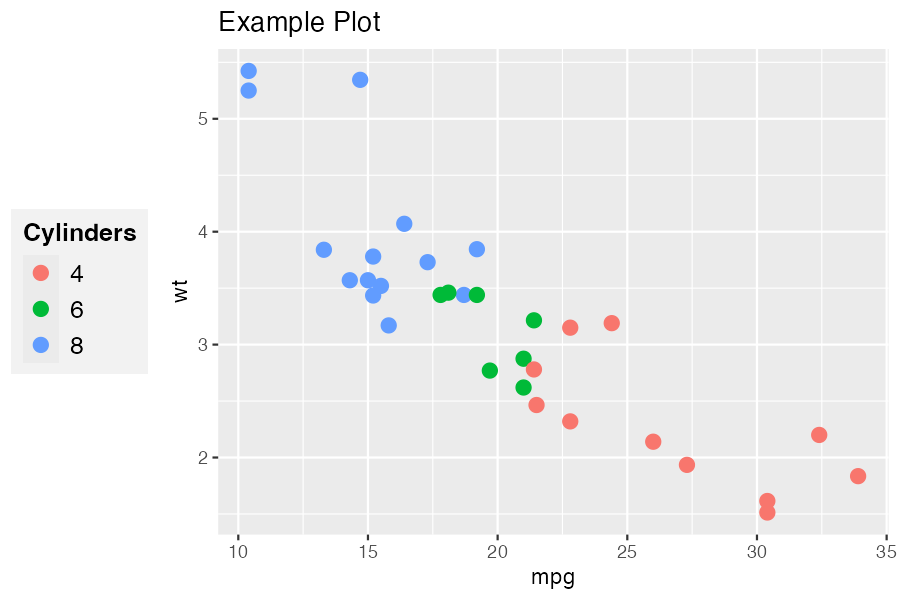

# ggguides

Simplified legend and guide alignment for ggplot2.

## Installation

```r
# Install from GitHub
# install.packages("pak")
pak::pak("gcol33/ggguides")
```

## Overview

ggguides provides one-liner functions for common legend operations in ggplot2:

- **Position**: `legend_left()`, `legend_right()`, `legend_top()`, `legend_bottom()`, `legend_inside()`, `legend_none()`
- **Direction**: `legend_horizontal()`, `legend_vertical()`
- **Style**: `legend_style()`, `legend_wrap()`, `legend_reverse()`
- **Patchwork**: `collect_legends()`, `align_guides_h()`

## Examples

### Position Helpers

```r
library(ggplot2)
library(ggguides)

p <- ggplot(mtcars, aes(mpg, wt, color = factor(cyl))) +
  geom_point(size = 3) +
  labs(color = "Cylinders")
```

#### `legend_left()` / `legend_right()`

Position with proper alignment (sets justification and box.just together):

```r
p + legend_left()
p + legend_right()
```

 

#### `legend_top()` / `legend_bottom()`

Horizontal layout with optional plot alignment:

```r
p + legend_top()
p + legend_bottom()

# Align to full plot (useful with titles)
p + labs(title = "My Title") + legend_top(align_to = "plot")
```

 

#### `legend_inside()`

Position inside the plot using coordinates or shortcuts:

```r
# Using shortcuts
p + legend_inside(position = "topright")
p + legend_inside(position = "bottomleft")

# Using coordinates
p + legend_inside(x = 0.95, y = 0.95, just = c("right", "top"))

# With custom styling
p + legend_inside(position = "center", background = "grey95", border = "grey50")
```

 

#### `legend_none()`

Remove the legend entirely:

```r
p + legend_none()
```


---

### Style Helpers

#### `legend_style()`

Comprehensive styling in one call:

```r
# Basic: font and size
p + legend_style(size = 14, family = "serif")

# Full styling
p + legend_style(
  size = 12,
  title_size = 14,
  title_face = "bold",
  key_width = 1.5,
  background = "grey95",
  background_color = "grey70",
  margin = 0.3
)
```

 

#### `legend_wrap()`

Wrap legend entries into columns or rows:

```r
ggplot(mpg, aes(displ, hwy, color = class)) +
  geom_point() +
  legend_wrap(ncol = 2)

# Or by rows
ggplot(mpg, aes(displ, hwy, color = class)) +
  geom_point() +
  legend_wrap(nrow = 2)
```

 

#### `legend_reverse()`

Reverse legend entry order:

```r
p + legend_reverse()
```



---

### Patchwork Integration

#### `collect_legends()`

Collect legends from patchwork compositions:

```r
library(patchwork)

p1 <- ggplot(mtcars, aes(mpg, wt, color = factor(cyl))) +
  geom_point() + labs(title = "Plot 1")
p2 <- ggplot(mtcars, aes(mpg, hp, color = factor(cyl))) +
  geom_point() + labs(title = "Plot 2")

# Without collection (duplicate legends)
p1 | p2

# With collection
collect_legends(p1 | p2)

# Position at bottom
collect_legends(p1 | p2, position = "bottom")
```




#### Height Spanning

For stacked plots, use `span = TRUE` to make the legend span the full height:

```r
p3 <- ggplot(mtcars, aes(mpg, disp, color = factor(cyl))) +
  geom_point() + labs(title = "Plot 3")

# Default: legend centered
collect_legends(p1 / p2 / p3, position = "right")

# With spanning: legend fills full height
gt <- collect_legends(p1 / p2 / p3, position = "right", span = TRUE)
grid::grid.draw(gt)
```

 

---

### Combining Functions

Functions compose naturally:

```r
ggplot(mpg, aes(displ, hwy, color = class)) +
  geom_point() +
  legend_left() +
  legend_style(size = 12, title_face = "bold", background = "grey95")
```



```r
ggplot(mpg, aes(displ, hwy, color = class)) +
  geom_point() +
  legend_wrap(ncol = 2) +
  legend_bottom()
```


---

## cowplot Users

For cowplot, we recommend the [lemon](https://github.com/stefanedwards/lemon) package which provides:

- `g_legend()` - extract legend as grob
- `grid_arrange_shared_legend()` - combine plots with shared legend
- `reposition_legend()` - place legend inside panels

ggguides functions like `legend_style()`, `legend_wrap()`, and position helpers work on individual plots regardless of layout package.

## License

MIT
