# ggguides

Simplified legend and guide alignment for ggplot2.

## Installation

```r
# install.packages("pak")
pak::pak("gcol33/ggguides")
```

## Overview

ggguides provides one-liner functions for common legend operations in ggplot2:

- **Position**: `legend_left()`, `legend_right()`, `legend_top()`, `legend_bottom()`, `legend_inside()`, `legend_none()`
- **Direction**: `legend_horizontal()`, `legend_vertical()`
- **Style**: `legend_style()`, `legend_wrap()`, `legend_reverse()`, `legend_order()`, `legend_keys()`, `colorbar_style()`
- **Multiple Legends**: `legend_hide()`, `legend_select()`, `legend_order_guides()`, `legend_merge()`, `legend_split()`
- **Multi-Panel**: `collect_legends()`, `collect_axes()` (patchwork), `shared_legend()`, `get_legend()` (cowplot/grid)

## Examples

### Position Helpers

```r
library(ggplot2)
library(ggguides)

p <- ggplot(mtcars, aes(mpg, wt, color = factor(cyl))) +
  geom_point(size = 3) +
  labs(color = "Cylinders")
```

#### `legend_left()` / `legend_right()`

Position with proper alignment (sets justification and box.just together):

```r
p + legend_left()
p + legend_right()
```

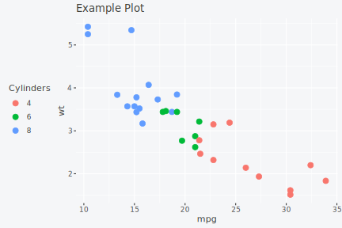 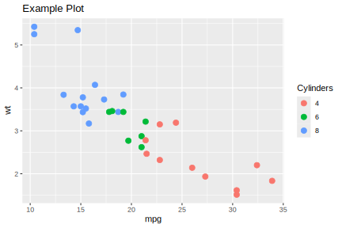

#### `legend_top()` / `legend_bottom()`

Horizontal layout with optional plot alignment:

```r
p + legend_top()
p + legend_bottom()

# Align to full plot (useful with titles)
p + labs(title = "My Title") + legend_top(align_to = "plot")
```

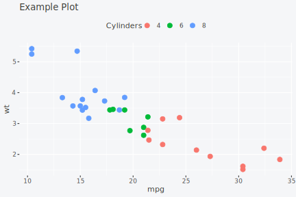 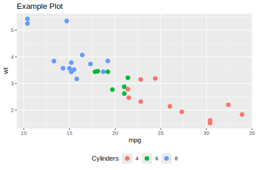

#### `legend_inside()`

Position inside the plot using coordinates or shortcuts:

```r
# Using shortcuts
p + legend_inside(position = "topright")
p + legend_inside(position = "bottomleft")

# Using coordinates
p + legend_inside(x = 0.95, y = 0.95, just = c("right", "top"))

# With custom styling
p + legend_inside(position = "center", background = "grey95", border = "grey50")
```

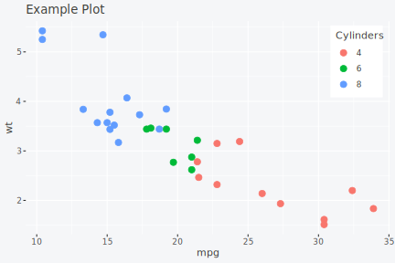 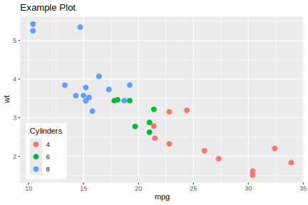

#### `legend_none()`

Remove the legend entirely:

```r
p + legend_none()
```

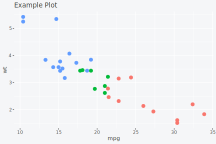

---

### Style Helpers

#### `legend_style()`

Comprehensive styling in one call:

```r
# Change font size - affects both title and labels
p + legend_style(size = 14)

# Change font family
p + legend_style(family = "serif")
p + legend_style(family = "mono")

# Combine size and family
p + legend_style(size = 14, family = "serif")
```

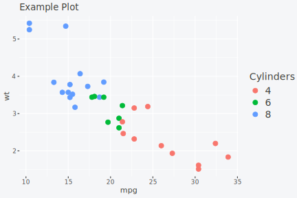 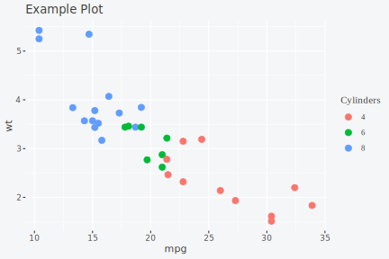

```r
# Full styling with title emphasis
p + legend_style(
  size = 12,
  title_size = 14,
  title_face = "bold",
  key_width = 1.5,
  background = "grey95",
  background_color = "grey70",
  margin = 0.3
)
```

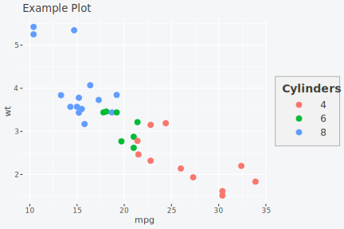

#### `legend_wrap()`

Wrap legend entries into columns or rows:

```r
ggplot(mpg, aes(displ, hwy, color = class)) +
  geom_point() +
  legend_wrap(ncol = 2)

# Or by rows
ggplot(mpg, aes(displ, hwy, color = class)) +
  geom_point() +
  legend_wrap(nrow = 2)
```

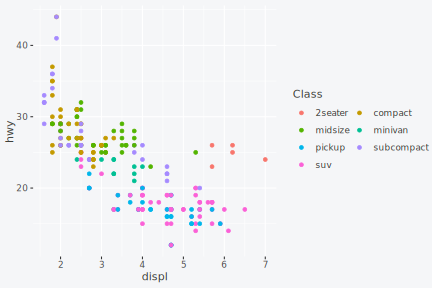 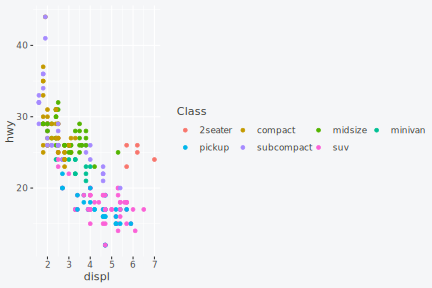

#### `legend_reverse()`

Reverse legend entry order:

```r
p + legend_reverse()
```

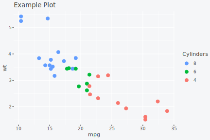

---

### Multiple Legends

When a plot has multiple aesthetics, control each legend separately:

#### `legend_hide()` / `legend_select()`

Hide specific legends or keep only certain ones:

```r
# Plot with multiple aesthetics
p <- ggplot(mtcars, aes(mpg, wt, color = factor(cyl), size = hp)) +
  geom_point() +
  labs(color = "Cylinders", size = "Horsepower")

# Hide the size legend
p + legend_hide(size)

# Keep only the colour legend
p + legend_select(colour)
```

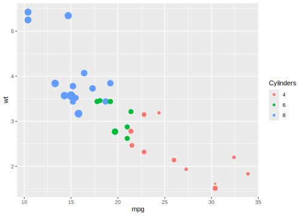 

#### Position legends separately

Use the `by` parameter to position legends independently:

```r
# Colour legend on left, size legend at bottom
p +
  legend_left(by = "colour") +
  legend_bottom(by = "size")
```

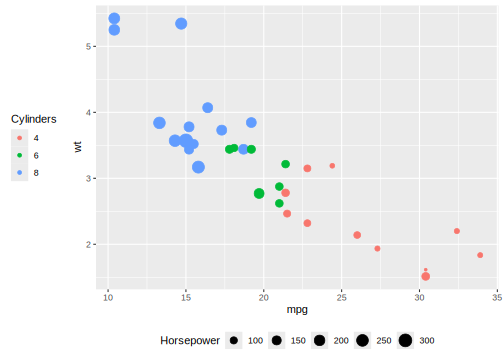

#### Style legends separately

Apply different styles to different legends:

```r
p +
  legend_style(title_face = "bold", by = "colour") +
  legend_style(size = 10, by = "size")
```


#### `legend_order_guides()`

Control the display order of multiple legends:

```r
# Size legend first, then colour
p + legend_order_guides(size = 1, colour = 2)
```

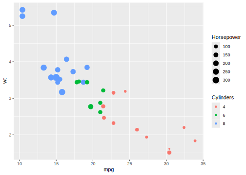

---

### Patchwork Integration

#### `collect_legends()`

Collect legends from patchwork compositions:

```r
library(patchwork)

p1 <- ggplot(mtcars, aes(mpg, wt, color = factor(cyl))) +
  geom_point() + labs(title = "Plot 1")
p2 <- ggplot(mtcars, aes(mpg, hp, color = factor(cyl))) +
  geom_point() + labs(title = "Plot 2")

# Without collection (duplicate legends)
p1 | p2

# With collection
collect_legends(p1 | p2)

# Position at bottom
collect_legends(p1 | p2, position = "bottom")
```

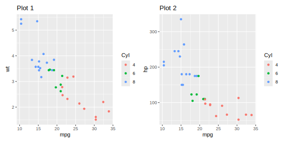

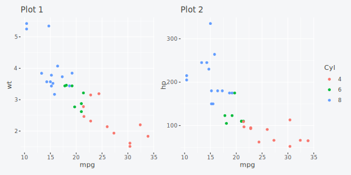

#### Height Spanning

For stacked plots, use `span = TRUE` to make the legend span the full height.
Using different plot heights makes the spanning behavior more visible:

```r
library(patchwork)

p3 <- ggplot(mtcars, aes(mpg, disp, color = factor(cyl))) +
  geom_point() + labs(title = "Plot 3")

# Stack with different heights: 4, 2, 1
stacked <- (p1 / p2 / p3) + plot_layout(heights = c(4, 2, 1))

# Default: legend centered
collect_legends(stacked, position = "right")

# With spanning: legend fills full height
gt <- collect_legends(stacked, position = "right", span = TRUE)
grid::grid.draw(gt)
```

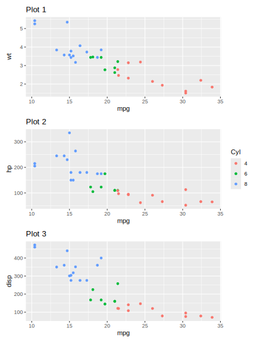 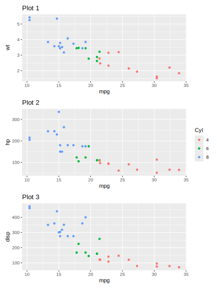

#### Row-Specific Attachment

Attach the legend to specific rows instead of spanning all:

```r
# Attach legend to row 1 only (the tallest plot)
gt <- collect_legends(stacked, position = "right", span = 1)
grid::grid.draw(gt)

# Attach legend to rows 1 and 2
gt <- collect_legends(stacked, position = "right", span = 1:2)
grid::grid.draw(gt)
```

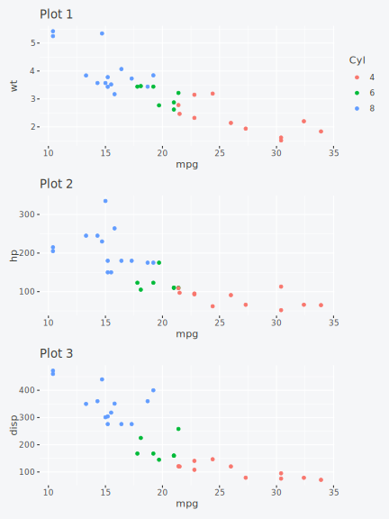 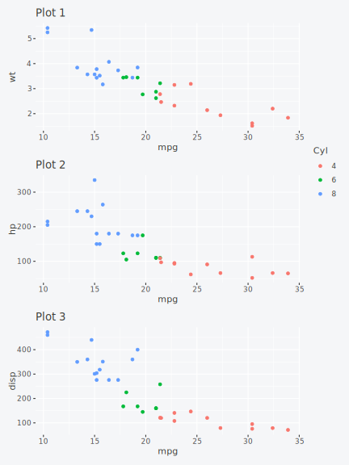

---

### Combining Functions

Functions compose naturally:

```r
ggplot(mpg, aes(displ, hwy, color = class)) +
  geom_point() +
  legend_left() +
  legend_style(size = 12, title_face = "bold", background = "grey95")
```

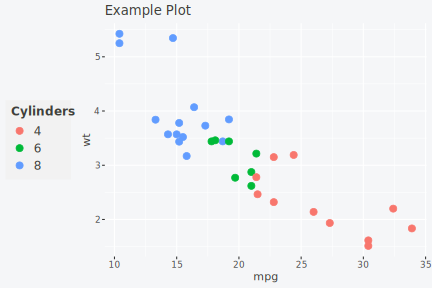

```r
ggplot(mpg, aes(displ, hwy, color = class)) +
  geom_point() +
  legend_wrap(ncol = 2) +
  legend_bottom()
```

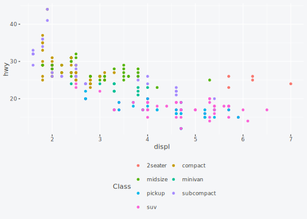

---

### cowplot / Base Grid Support

ggguides also works without patchwork for cowplot users or anyone using base grid:

#### `get_legend()`

Extract a legend as a standalone grob:

```r
p <- ggplot(mtcars, aes(mpg, wt, color = factor(cyl))) +
  geom_point() + labs(color = "Cylinders")

# Extract the legend
leg <- get_legend(p)

# Use with cowplot::plot_grid() or grid::grid.draw()
grid::grid.draw(leg)
```


#### `shared_legend()`

Combine plots with a shared legend (no patchwork required):

```r
p1 <- ggplot(mtcars, aes(mpg, wt, color = factor(cyl))) +
  geom_point() + labs(title = "Plot 1", color = "Cylinders")
p2 <- ggplot(mtcars, aes(mpg, hp, color = factor(cyl))) +
  geom_point() + labs(title = "Plot 2", color = "Cylinders")
p3 <- ggplot(mtcars, aes(mpg, disp, color = factor(cyl))) +
  geom_point() + labs(title = "Plot 3", color = "Cylinders")

# Side-by-side with shared legend
gt <- shared_legend(p1, p2, ncol = 2, position = "right")
grid::grid.draw(gt)

# Stacked with legend at bottom
gt <- shared_legend(p1, p2, p3, ncol = 1, position = "bottom")
grid::grid.draw(gt)

# 2x2 grid
gt <- shared_legend(p1, p2, p3, p1, ncol = 2, nrow = 2, position = "right")
grid::grid.draw(gt)
```

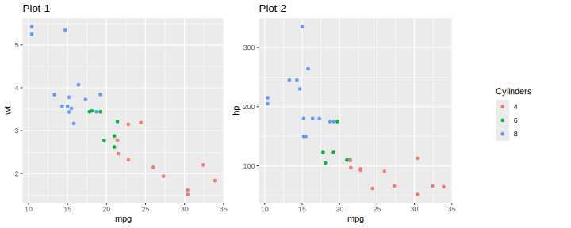

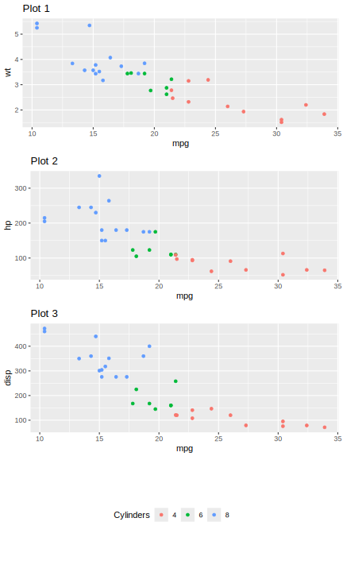

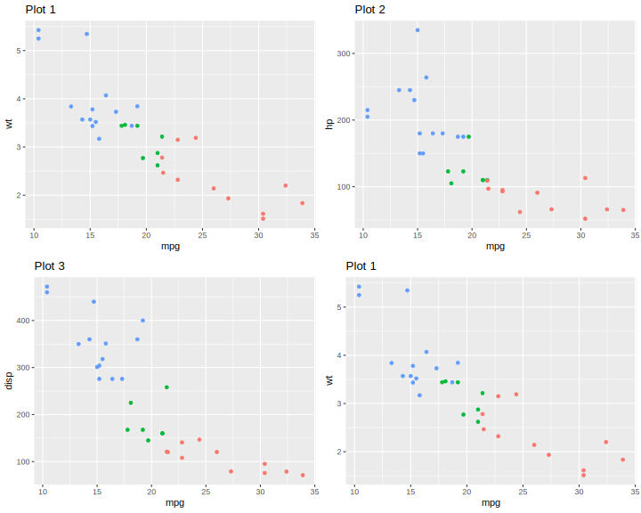

All ggguides styling functions (`legend_style()`, `legend_wrap()`, etc.) work on individual plots regardless of layout package.

## License

MIT
