# ggguides

[](https://CRAN.R-project.org/package=ggguides)
[](https://cran.r-project.org/package=ggguides)
[](https://cran.r-project.org/package=ggguides)
[](https://github.com/gcol33/ggguides/actions/workflows/R-CMD-check.yaml)
[](https://app.codecov.io/gh/gcol33/ggguides)
[](https://opensource.org/licenses/MIT)

**Simple, Intuitive Legend Control for ggplot2**

The `ggguides` package provides one-liner functions for common legend operations in ggplot2. Instead of memorizing `theme()` arguments and guide specifications, use readable functions like `legend_left()`, `legend_style()`, and `legend_inside()` to position, style, and customize legends with minimal code.

## Quick Start

```r
library(ggplot2)
library(ggguides)

p <- ggplot(mtcars, aes(mpg, wt, color = factor(cyl))) +
  geom_point(size = 3)

# Position legends
p + legend_left()
p + legend_inside("topright")

# Style legends
p + legend_style(size = 14, title_face = "bold")

# Combine freely
p + legend_bottom() + legend_style(background = "grey95")
```

## What ggguides Unlocks

Six legends — two on top, two on the right, one on the bottom, one on the left — each one placed, aligned, padded, and styled independently:

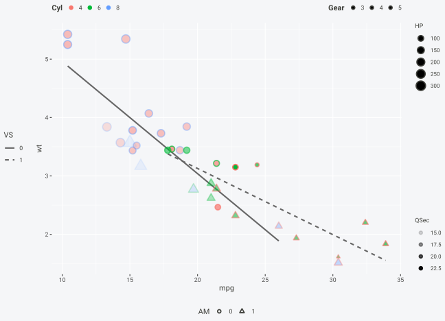

```r
p6 +
  # Send each legend to its side (two share the top rail, two the right rail)
  legend_top(by = "colour")    + legend_top(by = "fill")     +
  legend_right(by = "size")    + legend_right(by = "alpha")  +
  legend_bottom(by = "shape")  + legend_left(by = "linetype") +

  # Slide each one along its rail
  legend_style(by = "colour",   justification = "left")   +
  legend_style(by = "fill",     justification = "right")  +
  legend_style(by = "size",     justification = "top")    +
  legend_style(by = "alpha",    justification = "bottom") +

  # Per-legend appearance — title weight, key size, text size, direction
  legend_style(by = "colour", title_face = "bold",
               key_width = 0.4, key_height = 0.4) +
  legend_style(by = "size",   title_size = 9, size = 8)  +
  legend_style(by = "shape",  direction = "horizontal")
```

Every `legend_style(by = ...)` call is additive, so each concern gets its own line. Full walkthrough in the [Multiple Legends vignette](https://gillescolling.com/ggguides/articles/multiple-legends.html#six-legends-stacked-per-side).

## Statement of Need

Legend customization in ggplot2 often requires verbose `theme()` calls with non-obvious argument names (`legend.position`, `legend.justification`, `legend.box.just`), and guide specifications scattered across `guides()` and `scale_*()` functions. Common tasks like positioning a legend inside the plot, styling the legend box, or managing multiple legends require looking up documentation repeatedly.

`ggguides` addresses this by providing:

- **Readable function names** that describe what they do (`legend_left()`, `legend_inside()`, `legend_reverse()`)
- **Sensible defaults** that handle related settings together (e.g., `legend_left()` sets position, justification, and box alignment)
- **Consistent API** across positioning, styling, and multi-legend operations
- **Patchwork integration** for multi-panel figures with shared legends

## Installation

```r
install.packages("ggguides")
```

Or install the development version from GitHub:

```r
# install.packages("pak")
pak::pak("gcol33/ggguides")
```

## Features

### Position Functions

- **`legend_left()` / `legend_right()`**: Side positioning with proper alignment
- **`legend_top()` / `legend_bottom()`**: Horizontal layout with optional plot alignment
- **`legend_inside()`**: Position inside plot using coordinates or shortcuts (`"topright"`, `"bottomleft"`, etc.)
- **`legend_none()`**: Remove legend entirely

### Style Functions

- **`legend_style()`**: Comprehensive styling (size, font, background, borders, margins)
- **`legend_wrap()`**: Wrap entries into columns or rows
- **`legend_reverse()`**: Reverse entry order
- **`legend_order()`**: Reorder legend entries
- **`legend_keys()`**: Customize key appearance
- **`colorbar_style()`**: Style continuous color legends

### Multiple Legend Control

- **`legend_hide()` / `legend_select()`**: Show/hide specific legends by aesthetic
- **`legend_order_guides()`**: Control display order of multiple legends
- **`legend_merge()` / `legend_split()`**: Combine or separate legend entries
- **`by` parameter**: Apply any function to specific aesthetics only

### Multi-Panel Support

- **`collect_legends()`**: Collect legends from patchwork compositions
- **`collect_axes()`**: Collect axes from patchwork compositions
- **`shared_legend()`**: Combine plots with shared legend (no patchwork required)
- **`get_legend()`**: Extract legend as standalone grob

## Usage Examples

### Position Helpers

```r
library(ggplot2)
library(ggguides)

p <- ggplot(mtcars, aes(mpg, wt, color = factor(cyl))) +
  geom_point(size = 3) +
  labs(color = "Cylinders")
```

#### `legend_left()` / `legend_right()`

Position with proper alignment (sets justification and box.just together):

```r
p + legend_left()
p + legend_right()
```

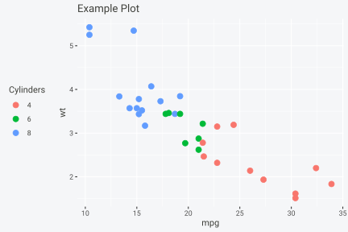 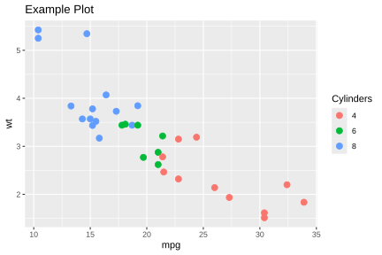

#### `legend_top()` / `legend_bottom()`

Horizontal layout with optional plot alignment:

```r
p + legend_top()
p + legend_bottom()

# Align to full plot (useful with titles)
p + labs(title = "My Title") + legend_top(align_to = "plot")
```

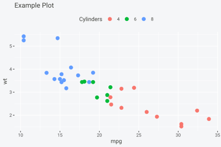 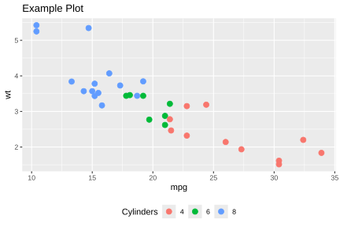

#### `legend_inside()`

Position inside the plot using coordinates or shortcuts:

```r
# Using shortcuts
p + legend_inside(position = "topright")
p + legend_inside(position = "bottomleft")

# Using coordinates
p + legend_inside(x = 0.95, y = 0.95, justification = c("right", "top"))

# With custom styling
p + legend_inside(position = "center", background = "grey95", border = "grey50")
```

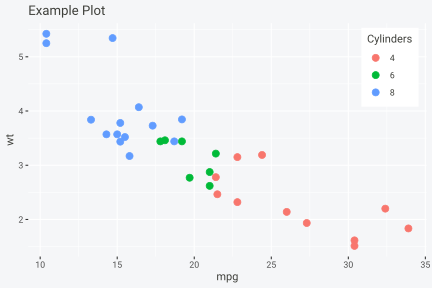 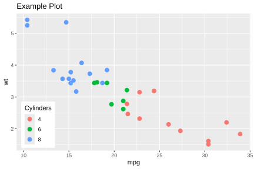

#### `legend_none()`

Remove the legend entirely:

```r
p + legend_none()
```

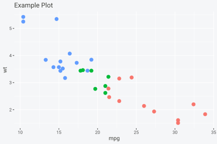

---

### Style Helpers

#### `legend_style()`

Comprehensive styling in one call:

```r
# Change font size - affects both title and labels
p + legend_style(size = 14)

# Change font family
p + legend_style(family = "serif")
p + legend_style(family = "mono")

# Combine size and family
p + legend_style(size = 14, family = "serif")
```

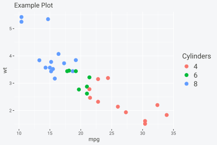 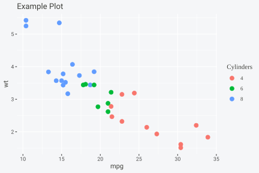

```r
# Full styling with title emphasis
p + legend_style(
  size = 12,
  title_size = 14,
  title_face = "bold",
  key_width = 1.5,
  background = "grey95",
  background_color = "grey70",
  margin = 0.3
)
```

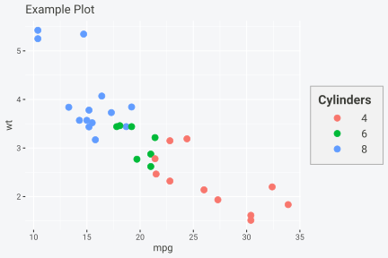

#### `legend_wrap()`

Wrap legend entries into columns or rows:

```r
ggplot(mpg, aes(displ, hwy, color = class)) +
  geom_point() +
  legend_wrap(ncol = 2)

# Or by rows
ggplot(mpg, aes(displ, hwy, color = class)) +
  geom_point() +
  legend_wrap(nrow = 2)
```

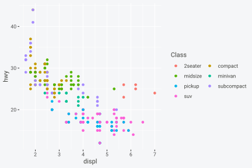 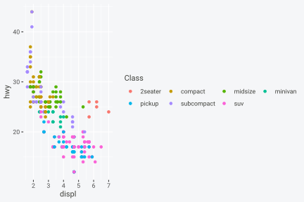

#### `legend_reverse()`

Reverse legend entry order:

```r
p + legend_reverse()
```

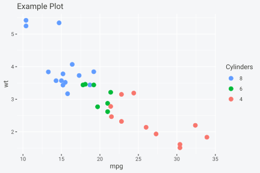

---

### Multiple Legends

When a plot has multiple aesthetics, control each legend separately:

#### `legend_hide()` / `legend_select()`

Hide specific legends or keep only certain ones:

```r
# Plot with multiple aesthetics
p <- ggplot(mtcars, aes(mpg, wt, color = factor(cyl), size = hp)) +
  geom_point() +
  labs(color = "Cylinders", size = "Horsepower")

# Hide the size legend
p + legend_hide(size)

# Keep only the colour legend
p + legend_select(colour)
```

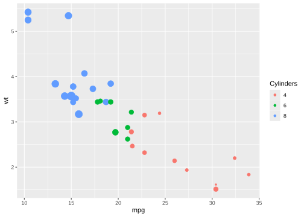 

#### Position legends separately

Use the `by` parameter to position legends independently:

```r
# Colour legend on left, size legend at bottom
p +
  legend_left(by = "colour") +
  legend_bottom(by = "size")
```

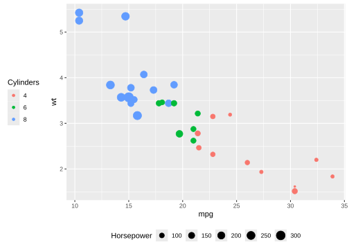

#### Style legends separately

Apply different styles to different legends:

```r
p +
  legend_style(title_face = "bold", by = "colour") +
  legend_style(size = 10, by = "size")
```

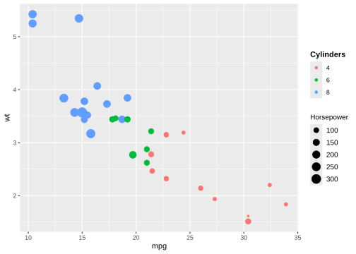

#### `legend_order_guides()`

Control the display order of multiple legends:

```r
# Size legend first, then colour
p + legend_order_guides(size = 1, colour = 2)
```

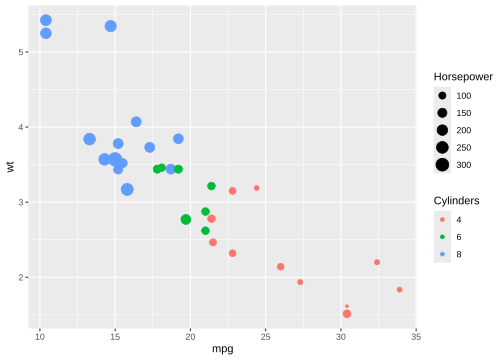

---

### Patchwork Integration

#### `collect_legends()`

Collect legends from patchwork compositions:

```r
library(patchwork)

p1 <- ggplot(mtcars, aes(mpg, wt, color = factor(cyl))) +
  geom_point() + labs(title = "Plot 1")
p2 <- ggplot(mtcars, aes(mpg, hp, color = factor(cyl))) +
  geom_point() + labs(title = "Plot 2")

# Without collection (duplicate legends)
p1 | p2

# With collection
collect_legends(p1 | p2)

# Position at bottom
collect_legends(p1 | p2, position = "bottom")
```

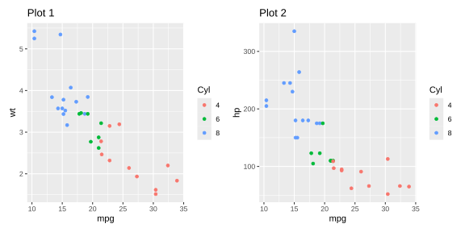

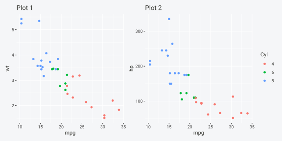

#### Height Spanning

For stacked plots, use `span = TRUE` to make the legend span the full height.
Using different plot heights makes the spanning behavior more visible:

```r
library(patchwork)

p3 <- ggplot(mtcars, aes(mpg, disp, color = factor(cyl))) +
  geom_point() + labs(title = "Plot 3")

# Stack with different heights: 4, 2, 1
stacked <- (p1 / p2 / p3) + plot_layout(heights = c(4, 2, 1))

# Default: legend centered
collect_legends(stacked, position = "right")

# With spanning: legend fills full height
gt <- collect_legends(stacked, position = "right", span = TRUE)
grid::grid.draw(gt)
```

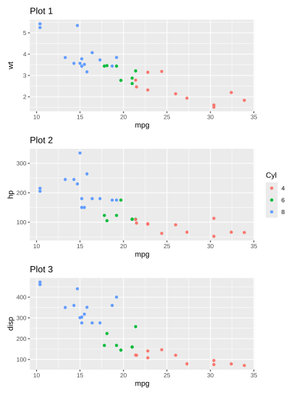 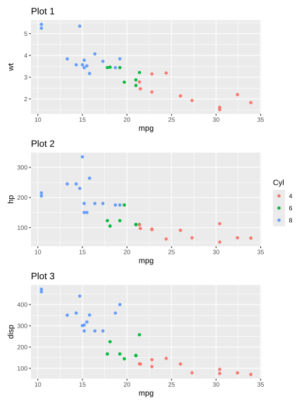

#### Row-Specific Attachment

Attach the legend to specific rows instead of spanning all:

```r
# Attach legend to row 1 only (the tallest plot)
gt <- collect_legends(stacked, position = "right", span = 1)
grid::grid.draw(gt)

# Attach legend to rows 1 and 2
gt <- collect_legends(stacked, position = "right", span = 1:2)
grid::grid.draw(gt)
```

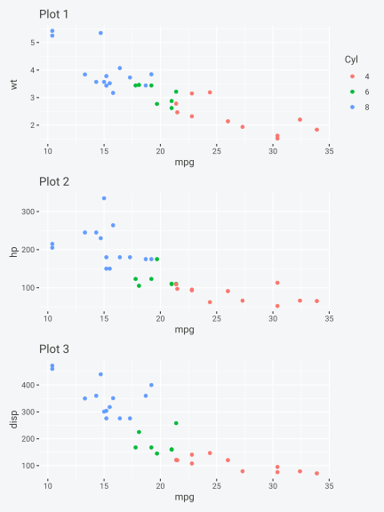 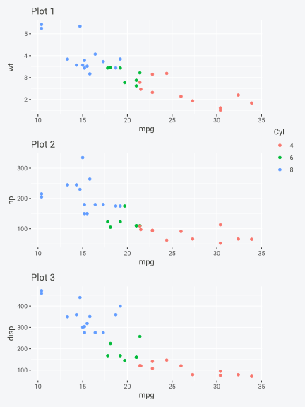

---

### Combining Functions

Functions compose naturally:

```r
ggplot(mpg, aes(displ, hwy, color = class)) +
  geom_point() +
  legend_left() +
  legend_style(size = 12, title_face = "bold", background = "grey95")
```

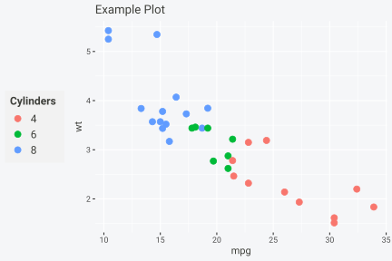

```r
ggplot(mpg, aes(displ, hwy, color = class)) +
  geom_point() +
  legend_wrap(ncol = 2) +
  legend_bottom()
```

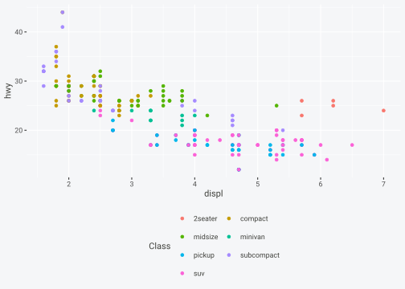

---

### cowplot / Base Grid Support

ggguides also works without patchwork for cowplot users or anyone using base grid:

#### `get_legend()`

Extract a legend as a standalone grob:

```r
p <- ggplot(mtcars, aes(mpg, wt, color = factor(cyl))) +
  geom_point() + labs(color = "Cylinders")

# Extract the legend
leg <- get_legend(p)

# Use with cowplot::plot_grid() or grid::grid.draw()
grid::grid.draw(leg)
```


#### `shared_legend()`

Combine plots with a shared legend (no patchwork required):

```r
p1 <- ggplot(mtcars, aes(mpg, wt, color = factor(cyl))) +
  geom_point() + labs(title = "Plot 1", color = "Cylinders")
p2 <- ggplot(mtcars, aes(mpg, hp, color = factor(cyl))) +
  geom_point() + labs(title = "Plot 2", color = "Cylinders")
p3 <- ggplot(mtcars, aes(mpg, disp, color = factor(cyl))) +
  geom_point() + labs(title = "Plot 3", color = "Cylinders")

# Side-by-side with shared legend
gt <- shared_legend(p1, p2, ncol = 2, position = "right")
grid::grid.draw(gt)

# Stacked with legend at bottom
gt <- shared_legend(p1, p2, p3, ncol = 1, position = "bottom")
grid::grid.draw(gt)

# 2x2 grid
gt <- shared_legend(p1, p2, p3, p1, ncol = 2, nrow = 2, position = "right")
grid::grid.draw(gt)
```

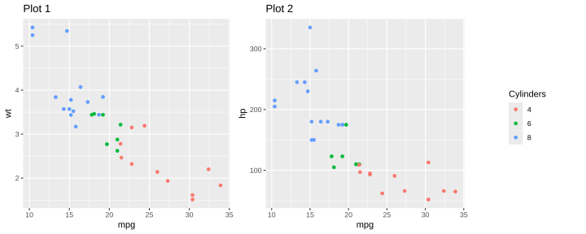

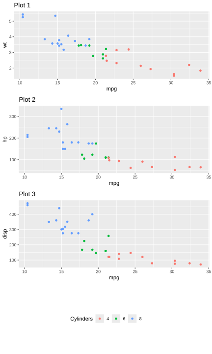

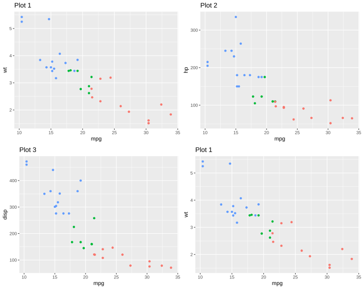

All ggguides styling functions (`legend_style()`, `legend_wrap()`, etc.) work on individual plots regardless of layout package.

## Documentation

- [Getting Started](https://gillescolling.com/ggguides/articles/getting-started.html)
- [Positioning](https://gillescolling.com/ggguides/articles/positioning.html)
- [Styling](https://gillescolling.com/ggguides/articles/styling.html)
- [Multiple Legends](https://gillescolling.com/ggguides/articles/multiple-legends.html)
- [Patchwork Integration](https://gillescolling.com/ggguides/articles/patchwork.html)

## Support

> "Software is like sex: it's better when it's free." — Linus Torvalds

I'm a PhD student who builds R packages in my free time because I believe good tools should be free and open. I started these projects for my own work and figured others might find them useful too.

If this package saved you some time, buying me a coffee is a nice way to say thanks. It helps with my coffee addiction.

[](https://buymeacoffee.com/gcol33)

## License

MIT (see the LICENSE.md file)

## Citation

```bibtex
@software{ggguides,
  author = {Colling, Gilles},
  title = {ggguides: Simplified Legend and Guide Alignment for ggplot2},
  year = {2025},
  url = {https://CRAN.R-project.org/package=ggguides},
  doi = {10.32614/CRAN.package.ggguides}
}
```
