# Multiple Legends

## Overview

When a plot maps multiple aesthetics (colour, size, shape, etc.),
ggplot2 creates separate legends for each. ggguides provides functions
to control these legends individually:

- **Hide specific legends** with
  [`legend_hide()`](https://gcol33.github.io/ggguides/reference/legend_hide.md)

- **Keep only certain legends** with
  [`legend_select()`](https://gcol33.github.io/ggguides/reference/legend_select.md)

- **Control display order** with
  [`legend_order_guides()`](https://gcol33.github.io/ggguides/reference/legend_order_guides.md)

- **Force merge/split** with
  [`legend_merge()`](https://gcol33.github.io/ggguides/reference/legend_merge.md)
  and
  [`legend_split()`](https://gcol33.github.io/ggguides/reference/legend_split.md)

- **Position legends separately** using `by` parameter on position
  functions

- **Style legends separately** using `by` parameter on
  [`legend_style()`](https://gcol33.github.io/ggguides/reference/legend_style.md)

## Example Plot

``` r

# Plot with multiple aesthetics
p <- ggplot(mtcars, aes(mpg, wt,
                        color = factor(cyl),
                        size = hp,
                        shape = factor(am))) +
  geom_point() +
  labs(color = "Cylinders", size = "Horsepower", shape = "Transmission")

p
```

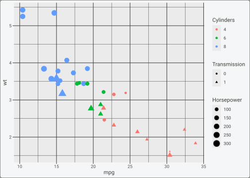

## Hiding Legends

Use
[`legend_hide()`](https://gcol33.github.io/ggguides/reference/legend_hide.md)
to remove specific legends while keeping others:

``` r

# Hide the size legend
p + legend_hide(size)
```


``` r


# Hide multiple legends
p + legend_hide(size, shape)
```


## Selecting Legends

Use
[`legend_select()`](https://gcol33.github.io/ggguides/reference/legend_select.md)
to keep only certain legends (inverse of
[`legend_hide()`](https://gcol33.github.io/ggguides/reference/legend_hide.md)):

``` r

# Keep only the colour legend
p + legend_select(colour)
```

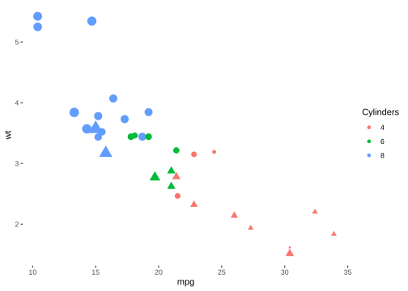

``` r


# Keep colour and shape
p + legend_select(colour, shape)
```

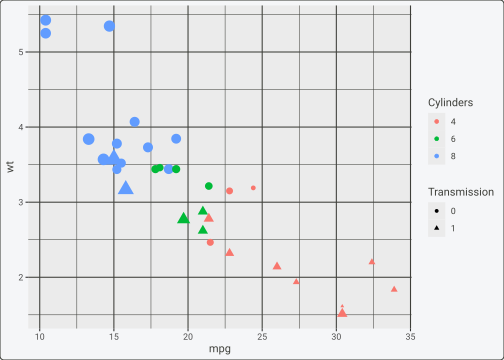

## Controlling Legend Order

By default, legends appear in an unspecified order. Use
[`legend_order_guides()`](https://gcol33.github.io/ggguides/reference/legend_order_guides.md)
to control the display order:

``` r

# Default order
p
```


``` r


# Size legend first, then colour, then shape
p + legend_order_guides(size = 1, colour = 2, shape = 3)
```

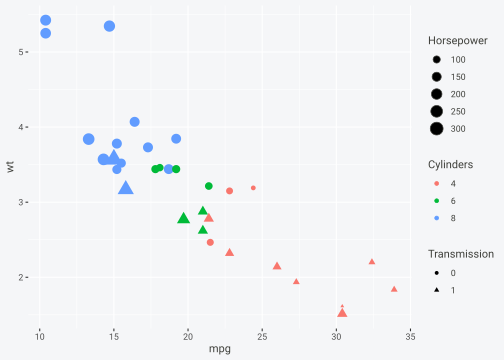

## Merging and Splitting Legends

ggplot2 automatically merges legends when they have the same title and
matching labels. Use
[`legend_merge()`](https://gcol33.github.io/ggguides/reference/legend_merge.md)
and
[`legend_split()`](https://gcol33.github.io/ggguides/reference/legend_split.md)
to override this behavior.

### Forcing Merge

``` r

# Plot where colour and fill map to the same variable
p_merge <- ggplot(mtcars, aes(mpg, wt, color = factor(cyl), fill = factor(cyl))) +
  geom_point(shape = 21, size = 4, stroke = 1.5) +
  labs(color = "Cylinders", fill = "Cylinders")

# Legends merge automatically when titles and labels match
p_merge
```


``` r


# Explicitly request merge (reinforces default behavior)
p_merge + legend_merge(colour, fill)
```

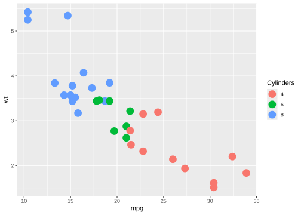

### Forcing Split

``` r

# Force separate legends even when they could merge
p_merge + legend_split(colour, fill)
```

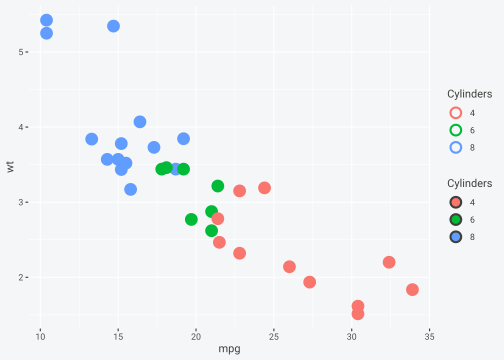

## Positioning Legends Separately

Position functions
([`legend_left()`](https://gcol33.github.io/ggguides/reference/legend_left.md),
[`legend_right()`](https://gcol33.github.io/ggguides/reference/legend_right.md),
[`legend_top()`](https://gcol33.github.io/ggguides/reference/legend_top.md),
[`legend_bottom()`](https://gcol33.github.io/ggguides/reference/legend_bottom.md))
accept a `by` parameter to position specific legends:

``` r

# Place colour legend on the left, size legend at bottom
p +
  legend_hide(shape) +
  legend_left(by = "colour") +
  legend_bottom(by = "size")
```

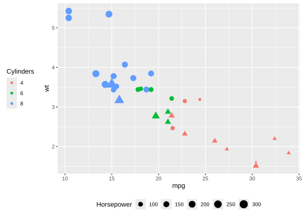

``` r

# Colour legend on top, size on right
p +
  legend_hide(shape) +
  legend_top(by = "colour") +
  legend_right(by = "size")
```

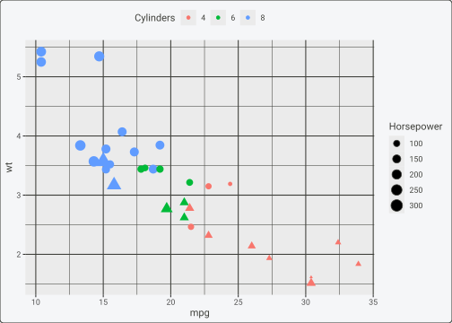

## Styling Legends Separately

Use the `by` parameter on
[`legend_style()`](https://gcol33.github.io/ggguides/reference/legend_style.md)
to apply different styles to different legends:

``` r

p +
  legend_hide(shape) +
  legend_style(title_face = "bold", background = "grey95", by = "colour") +
  legend_style(size = 10, by = "size")
```

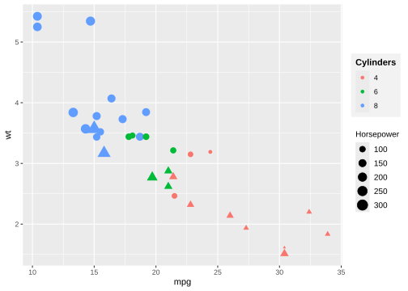

## Four Legends, One per Side

When a plot has four legends and you want one on each side (top, bottom,
left, right), you can fine-tune each legend along three axes:

1.  **Side placement** — `legend_top/bottom/left/right(by = "<aes>")`

2.  **Distance from the panel** —
    `legend_style(by = "<aes>", margin = c(t, r, b, l))`

3.  **Slide along the side** —
    `legend_style(by = "<aes>", justification = ...)`

For top/bottom legends, `justification` is `"left"`, `"center"`,
`"right"` (or a number in `[0, 1]`). For left/right legends, it’s
`"top"`, `"center"`, `"bottom"` (or a number).

``` r

p4 <- ggplot(mtcars, aes(mpg, wt,
                         colour = factor(cyl),
                         fill   = factor(gear),
                         size   = hp,
                         shape  = factor(am))) +
  geom_point(stroke = 1.2) +
  labs(colour = "Cyl", fill = "Gear", size = "HP", shape = "AM")

p4 +
  # 1. Send each legend to its side
  legend_top   (by = "colour") +
  legend_bottom(by = "fill")   +
  legend_left  (by = "size")   +
  legend_right (by = "shape")  +

  # 2. Slide each legend along its side
  legend_style(by = "colour", justification = "left") +
  legend_style(by = "fill",   justification = "right") +
  legend_style(by = "size",   justification = "top") +
  legend_style(by = "shape",  justification = "bottom") +

  # 3. Nudge each legend toward/away from the panel via margin (cm)
  legend_style(by = "colour", margin = c(0, 0, 0.3, 0)) +
  legend_style(by = "fill",   margin = c(0.3, 0, 0, 0)) +
  legend_style(by = "size",   margin = c(0, 0.3, 0, 0)) +
  legend_style(by = "shape",  margin = c(0, 0, 0, 0.3))
```

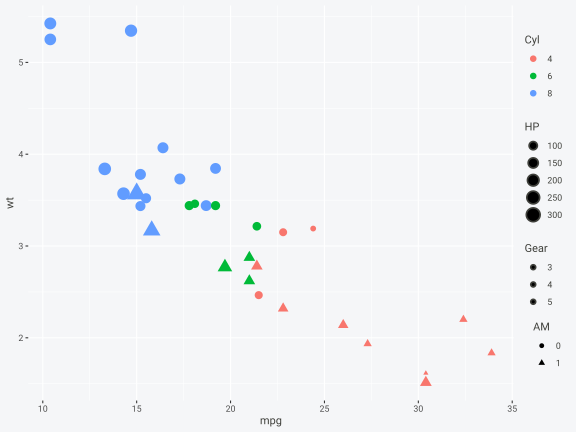

Each `legend_style(by = ...)` call is additive — you can chain as many
as you need to tune one legend at a time without affecting the others.

## Six Legends, Stacked per Side

ggplot2 allows more than one legend to share a side — they stack in the
order ggplot2 resolves them. With ggguides you can send any legend to
any side, then slide and pad each one independently. The plot below has
**six** legends: two on top, two on the right, one on the bottom, one on
the left.

``` r

p6 <- ggplot(mtcars, aes(mpg, wt)) +
  geom_smooth(aes(linetype = factor(vs)), method = "lm", se = FALSE,
              colour = "grey40") +
  geom_point(aes(colour = factor(cyl),
                 fill   = factor(gear),
                 size   = hp,
                 alpha  = qsec,
                 shape  = factor(am)),
             stroke = 1.2) +
  scale_shape_manual(values = c(21, 24)) +
  labs(colour = "Cyl", fill = "Gear", size = "HP",
       alpha = "QSec", shape = "AM", linetype = "VS")

p6 +
  # 1. Side placement — two legends share the top, two share the right
  legend_top   (by = "colour")   +
  legend_top   (by = "fill")     +
  legend_right (by = "size")     +
  legend_right (by = "alpha")    +
  legend_bottom(by = "shape")    +
  legend_left  (by = "linetype") +

  # 2. Slide each legend along its rail
  #    top/bottom rails: "left" / "center" / "right" (or a number in [0,1])
  #    left/right rails: "top"  / "center" / "bottom"
  legend_style(by = "colour",   justification = "left")   +
  legend_style(by = "fill",     justification = "right")  +
  legend_style(by = "size",     justification = "top")    +
  legend_style(by = "alpha",    justification = "bottom") +
  legend_style(by = "shape",    justification = "center") +
  legend_style(by = "linetype", justification = "center") +

  # 3. Appearance — per-legend title weight, key size, direction, text size
  legend_style(by = "colour",   title_face = "bold",
               key_width = 0.4, key_height = 0.4) +
  legend_style(by = "fill",     title_face = "bold",
               key_width = 0.4, key_height = 0.4) +
  legend_style(by = "size",     title_size = 9, size = 8)  +
  legend_style(by = "alpha",    title_size = 9, size = 8)  +
  legend_style(by = "shape",    direction = "horizontal")  +
  legend_style(by = "linetype", direction = "vertical")    +

  # 4. Nudge each legend toward/away from the panel via margin (cm)
  #    order is c(top, right, bottom, left)
  legend_style(by = "colour",   margin = c(0, 0, 0.2, 0)) +
  legend_style(by = "fill",     margin = c(0, 0, 0.2, 0)) +
  legend_style(by = "size",     margin = c(0, 0, 0, 0.3)) +
  legend_style(by = "alpha",    margin = c(0, 0, 0, 0.3)) +
  legend_style(by = "shape",    margin = c(0.3, 0, 0, 0)) +
  legend_style(by = "linetype", margin = c(0, 0.3, 0, 0))
#> `geom_smooth()` using formula = 'y ~ x'
```

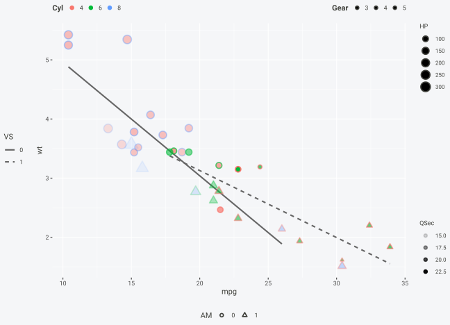

### What each step is doing

**Step 1 — side placement.** `legend_<side>(by = "<aes>")` sends one
legend to one side. Call it twice with different aesthetics and both
legends land on that side; ggplot2 stacks them in the order they’re
resolved. Here `colour` + `fill` share the top rail, `size` + `alpha`
share the right rail, and `shape` / `linetype` get a side of their own.

**Step 2 — slide along the rail.**
`legend_style(by = "<aes>", justification = ...)` repositions a single
legend without affecting its neighbours. The keyword interpretation
depends on which rail the legend sits on:

- **Top / bottom rail** (horizontal): `"left"`, `"center"`, `"right"`,
  or a number in `[0, 1]` (0 = flush left, 1 = flush right). In the
  example, `colour` is pushed to the left end of the top rail and `fill`
  to the right end, so the two top legends fan out to opposite corners.

- **Left / right rail** (vertical): `"top"`, `"center"`, `"bottom"`, or
  a number (0 = bottom, 1 = top). `size` is pinned to the top of the
  right rail and `alpha` to the bottom.

You can mix this with whole-plot justification via
`legend_style(justification = ...)` (no `by`), but the per-guide form is
what you want when different legends need different alignments.

**Step 3 — appearance.** Anything
[`legend_style()`](https://gcol33.github.io/ggguides/reference/legend_style.md)
accepts (`title_face`, `title_size`, `size` for label text, `key_width`,
`key_height`, `direction`, `background`, …) can be scoped to a single
legend by adding `by = "<aes>"`. Calls are additive — each line tunes
one axis of one legend and leaves the rest untouched — so chaining many
short calls is idiomatic and easier to read than one megacall. Here the
top legends get bold titles and smaller keys, the right legends get
smaller text, and `shape` is forced horizontal to fit the bottom rail
while `linetype` stays vertical for the left rail.

**Step 4 — padding.** `margin = c(top, right, bottom, left)` (in cm)
nudges a single legend toward or away from the panel. Always pad on the
side that faces the panel: a bottom legend uses `c(top, 0, 0, 0)`, a
left legend uses `c(0, right, 0, 0)`, and so on. This is often the
difference between “legend readable” and “legend crammed against the
axis text”.

### Why four separate calls per legend, not one

`legend_style(by = "colour", ...)` is additive on purpose. You could
merge all four style calls for `colour` into a single one, but splitting
them by concern (position / alignment / appearance / padding) means
every parameter lives on a line that is easy to find and tweak in
isolation. When a reviewer asks “can you move the colour legend half a
centimetre down?” you edit one number on one line, not a twenty-argument
call.

## Combining Multiple Controls

All functions work together:

``` r

# Complex example: hide shape, position colour on left with bold title,
# position size at bottom with smaller text
p +
  legend_hide(shape) +
  legend_left(by = "colour") +
  legend_style(title_face = "bold", title_size = 14, by = "colour") +
  legend_bottom(by = "size") +
  legend_style(size = 9, direction = "horizontal", by = "size")
```

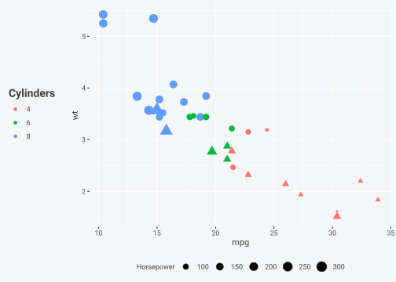

## Summary

| Function | Purpose | Parameters |
|----|----|----|
| [`legend_hide()`](https://gcol33.github.io/ggguides/reference/legend_hide.md) | Hide specific legends | Aesthetic names (unquoted) |
| [`legend_select()`](https://gcol33.github.io/ggguides/reference/legend_select.md) | Keep only specific legends | Aesthetic names (unquoted) |
| [`legend_order_guides()`](https://gcol33.github.io/ggguides/reference/legend_order_guides.md) | Control legend display order | Named args: `aes = order` |
| [`legend_merge()`](https://gcol33.github.io/ggguides/reference/legend_merge.md) | Force legends to merge | Aesthetic names (unquoted) |
| [`legend_split()`](https://gcol33.github.io/ggguides/reference/legend_split.md) | Force legends to stay separate | Aesthetic names (unquoted) |
| `legend_left(by=)` | Position one legend on left | `by = "aesthetic"` |
| `legend_style(by=)` | Style one legend | `by = "aesthetic"` + style args |

**Learn more:**

- [Legend
  Positioning](https://gcol33.github.io/ggguides/articles/positioning.md)
  for single-legend placement

- [Styling &
  Customization](https://gcol33.github.io/ggguides/articles/styling.md)
  for legend appearance

- [Patchwork
  Integration](https://gcol33.github.io/ggguides/articles/patchwork.md)
  for multi-panel plots
