# Legend Positioning

## Overview

ggguides provides position helpers that handle legend placement without
requiring knowledge of ggplot2’s theme system. Each function sets the
appropriate combination of `legend.position`, `legend.justification`,
and `legend.box.just` to achieve proper alignment.

## Basic Positioning

### Left and Right

``` r

p <- ggplot(mtcars, aes(mpg, wt, color = factor(cyl))) +
  geom_point(size = 3) +
  labs(color = "Cylinders")

p + legend_left() + ggtitle("Left")
p + legend_right() + ggtitle("Right")
```

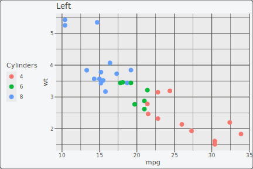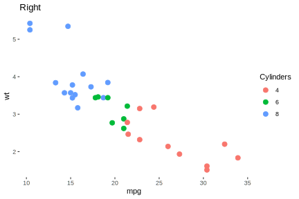

### Top and Bottom

When placing legends at the top or bottom, the legend is automatically
oriented horizontally:

``` r

p + legend_top() + ggtitle("Top")
p + legend_bottom() + ggtitle("Bottom")
```

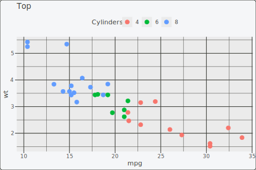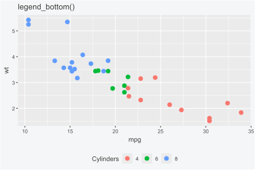

### Alignment with Titles

Use the `align_to` parameter to control how the legend aligns with the
plot. The difference is most visible when there’s a y-axis label:

``` r

p_labeled <- p + labs(title = "Fuel Economy", y = "Weight (1000 lbs)")

# Default: align to panel (legend aligns with the plot area)
p_labeled + legend_top() + ggtitle("Panel alignment (default)")

# Align to full plot (legend spans title/axis labels too)
p_labeled + legend_top(align_to = "plot") + ggtitle("Plot alignment")
```

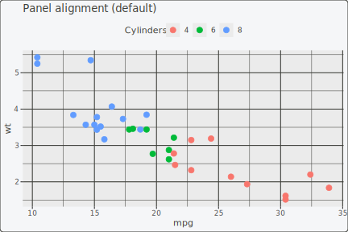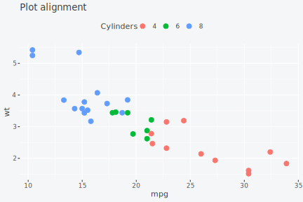

## Inside Positioning

[`legend_inside()`](https://gcol33.github.io/ggguides/reference/legend_inside.md)
places the legend within the plot panel. You can use either coordinate
values or named shortcuts.

### Using Shortcuts

Available shortcuts: `"topright"`, `"topleft"`, `"bottomright"`,
`"bottomleft"`, `"center"`

``` r

p + legend_inside(position = "topright") + ggtitle("Top right")
p + legend_inside(position = "bottomleft") + ggtitle("Bottom left")
```

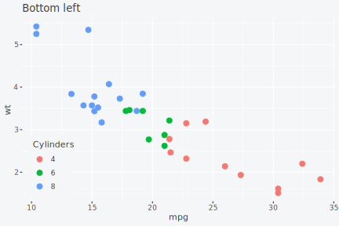

### Using Coordinates

For precise control, specify x/y coordinates (0-1 scale) and
justification:

``` r

p + legend_inside(x = 0.95, y = 0.95, just = c("right", "top"))
```

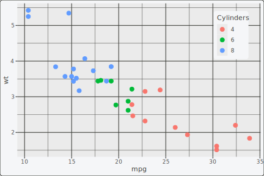

### Adding Background

Inside legends often need a background for readability:

``` r

p + legend_inside(
  position = "topright",
  background = "#FFF3E0",
  border = "#FF9800"
)
```


## Direction Control

### Horizontal and Vertical

Control legend entry direction independently of position:

``` r

p + legend_horizontal() + ggtitle("Horizontal")
p + legend_vertical() + ggtitle("Vertical")
```

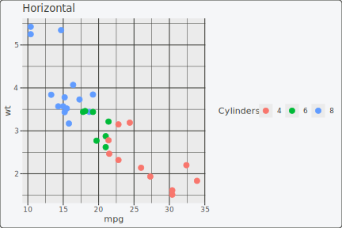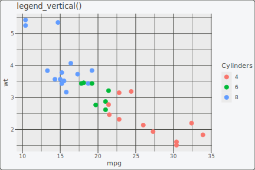

### Combining Direction and Position

``` r

p + legend_right() + legend_horizontal()
```

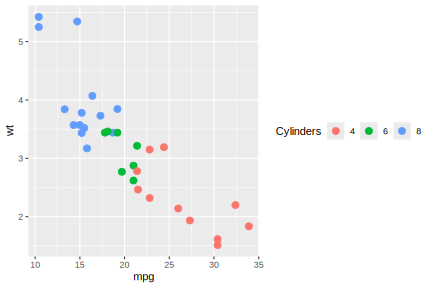

## Removing the Legend

``` r

p + legend_none()
```

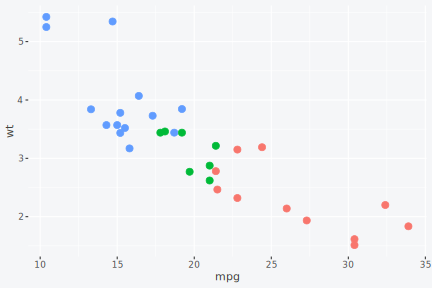

## Summary

| Function | Position | Auto-Direction |
|----|----|----|
| [`legend_left()`](https://gcol33.github.io/ggguides/reference/legend_left.md) | Left of panel | Vertical |
| [`legend_right()`](https://gcol33.github.io/ggguides/reference/legend_right.md) | Right of panel | Vertical |
| [`legend_top()`](https://gcol33.github.io/ggguides/reference/legend_top.md) | Above panel | Horizontal |
| [`legend_bottom()`](https://gcol33.github.io/ggguides/reference/legend_bottom.md) | Below panel | Horizontal |
| [`legend_inside()`](https://gcol33.github.io/ggguides/reference/legend_inside.md) | Inside panel | Unchanged |
| [`legend_none()`](https://gcol33.github.io/ggguides/reference/legend_none.md) | Hidden | N/A |

**Learn more:**

- [Styling &
  Customization](https://gcol33.github.io/ggguides/articles/styling.md)
  for font, background, and border options
- [Patchwork
  Integration](https://gcol33.github.io/ggguides/articles/patchwork.md)
  for multi-panel workflows
